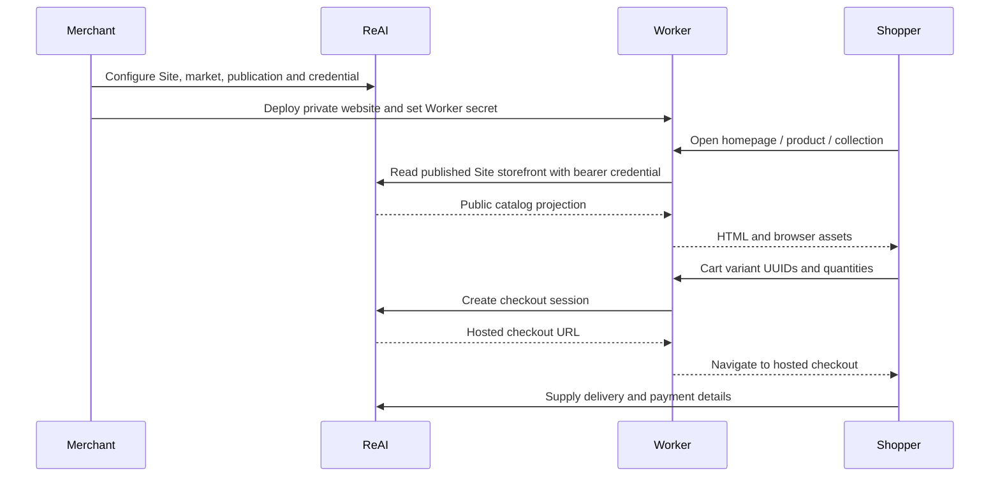

# How ReAI Sites work

A **Site** is a tenant-owned website identity. A tenant is the business account
that owns the underlying catalog and operational data. One tenant can have
several Sites: separate brands, countries, shops or a non-commerce website.
A Site does not require commerce. Enabling commerce adds market, publication,
collection and checkout configuration around that identity.

## Three separate things

1. **ReAI Site configuration** identifies the website and controls which public
   data it can deliver, its markets and its accepted domains.
2. **Website source** lives in a Git repository: layout, CSS, browser behavior,
   authored content and server-side integration.
3. **Hosting** runs that source. These examples use a Cloudflare Worker and Static
   Assets. ReAI supplies business data and hosted checkout; it does not require
   the storefront layout to live inside the ReAI application.

Creating a repository does not publish a product. Deploying a Worker does not
change the tenant's accounting data. Changing a product's publication or market
price can update a storefront without a website deployment.

## Delivery and management

| Surface | Authentication | Responsibility |
| --- | --- | --- |
| `/api/sites/**` | Authorized tenant session or tenant public API authentication | Create/configure Sites, markets, publications, collections and Site credentials |
| `/site/v1/**` | Site-scoped bearer credential kept on the server | Deliver public Site identity, published catalog, availability and checkout creation |
| Storefront routes | Shopper browser; no ReAI secret | Render pages, maintain cart and ask its Worker to start hosted checkout |

A delivery token is not a tenant management token. It cannot be used to edit the
business catalog or to inspect other tenants. Public delivery contains opaque
UUIDs and public merchandising information; it omits internal numeric tenant
identifiers, costs, margins, warehouse quantities and VAT codes.

## Typical flow

The `onlineStoreEnabled` tenant module gates Site management and Site credential
authentication. Disabling that module retains Site data. Previously accepted
payment outcomes still need to settle; disabling a website is not an order or
accounting history deletion.

A disabled Site is different from an unpublished product. Check Site and tenant
module status when the whole delivery surface is unavailable; check per-Site
publication and market configuration when only a product is missing.

Canonical contracts: [delivery explorer](https://app.reai.no/openapi/site/ui)
and [management explorer](https://app.reai.no/openapi/public/ui).
