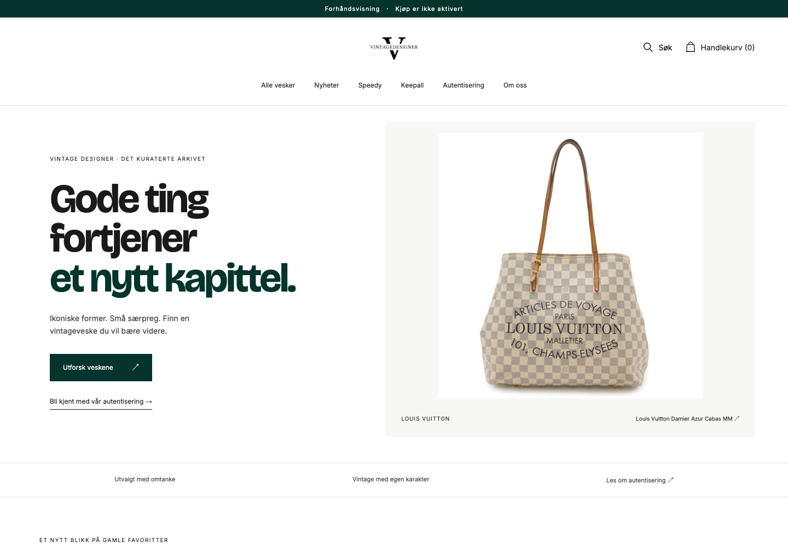
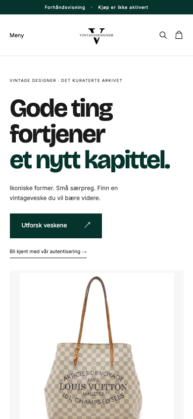

# Vintage Designer local verification

Verified 2026-09-07. This is a local storefront, not a deployed or live-ReAI shop.

## Scope

Norwegian home, collections, product pages, search, gallery, persistent cart, authentication/about/contact/policy pages, journal with two guide excerpts, checkout-return shell, sitemap and branded 404. The original logo and fonts are retained. Checkout is denied before upstream calls, even if an enabling environment value is supplied.

Real sample products and their photographs are ignored local files, never part of the application bundle. Two homepage screenshots below document the visual direction; they contain no product prices or stock listing and are not catalog data. Other route comparisons were inspected locally without committing their catalog screenshots.

## Automated checks

- Type checking, API-client boundary checks and all 18 shared tests passed.
- Seven focused storefront tests passed, including VAT-inclusive display prices, checkout denial without upstream calls, security/indexing headers, HEAD/redirect behavior, missing API configuration, escaped content, image metadata and empty/unknown routes.
- Four local-harness tests passed, including explicit fixture startup, actual Worker/client integration and deployment-fixture rejection.
- All repository site checks and all four Worker dry runs passed. No deployment was performed.
- Dependency audit: zero vulnerabilities. `git diff --check` passed.
- The repository live API-contract freshness check failed locally and in CI: generated declarations differ from the currently served OpenAPI document (the first difference is route ordering). The existing generated client/types were not modified by this storefront change. Reconcile this repository-wide drift before merging/live integration; type checking and the client boundary pass against the committed contract.

## Browser verification

Chromium at 1440×1000 and 390×844, with source and local screenshots for home, collection, product, search, cart, authentication and 404. All 14 local route/viewport combinations had no horizontal overflow, exactly one H1 and no images missing an alt attribute. Reviewed layout, original branding, product framing and responsive gallery.

- Mobile search overlay opens with input focus; Escape closes it. Skip link is visible on keyboard focus and moves focus to main. Reduced-motion preference is supported.
- Gucci query returns the matching sample; empty and no-result queries have Norwegian messages.
- Brand filter, sold filter, ascending prices and unsupported query defaults verified. Available products precede sold ones; sold inventory has a separate heading. Filter URLs are shareable.
- Gallery buttons change the main image and selected state. The provenance panel extracts only supplied condition/dimension lines, leaving other detail in the full description.
- Adding an available sample persists after navigation/reload. Removing it returns the empty-cart state. Sold products cannot be added. Checkout remains disabled.
- Missing image/price metadata shows explicit placeholders, not invented values. Source alt text and fallback product context are rendered; intrinsic dimensions and width renditions are preserved when supplied.
- Healthy catalog browser console: zero errors/warnings. Browser data requests use same-origin `/reai/*` routes. Deliberate failure mode returns catalog 503 and product/collection 502; search displays a localized error without sample fallback. Unknown routes return branded 404.

## Remaining work

No ReAI records or credentials were created. Live market/publication/price/image/availability verification and Cloudflare deployment remain deferred. Checkout is deliberately unavailable. Journal pages are short source-backed excerpts with links to full originals; policy pages refer to the current authoritative terms rather than inventing replacement legal text.

## Local homepage screenshots

